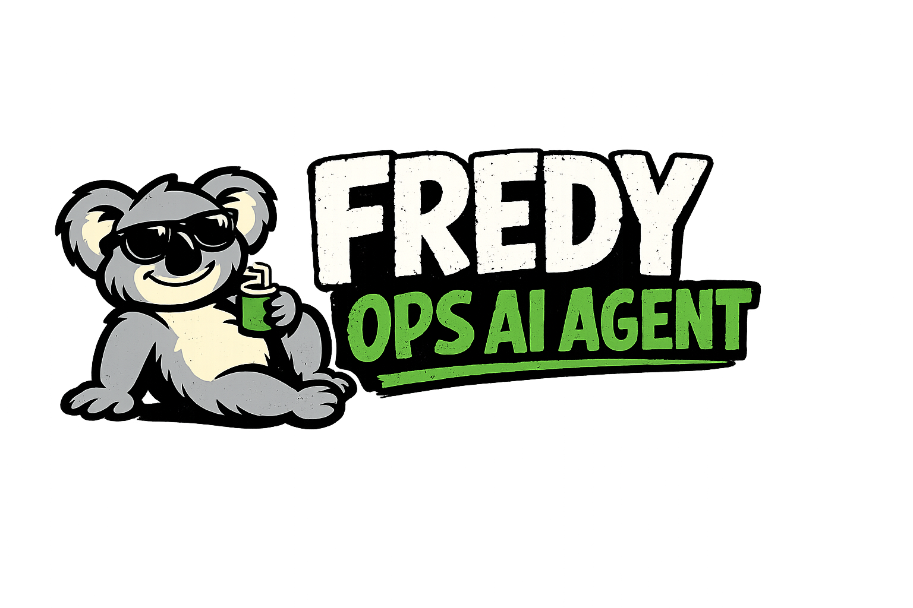

# 🐨 Fredy — OPS-AI Assistant



An AI Agent platform for exploring and implementing generative AI best practices — RAG pipelines, MCP servers, and autonomous agents backed by Claude.

## Services

| Service | URL | Description |
|---------|-----|-------------|
| Open-WebUI | http://localhost:3000 | Chat interface (connected to LiteLLM + Qdrant) |
| LiteLLM | http://localhost:4000 | OpenAI-compatible proxy routing to Claude |
| Ollama | http://localhost:11434 | Local LLM runtime |
| Qdrant | http://localhost:6333 | Vector database for RAG |
| Confluence Importer | — | Background sync: Confluence / local files → Qdrant |

## Prerequisites

- [Docker](https://docs.docker.com/get-docker/) with Compose v2
- An [Anthropic API key](https://console.anthropic.com/)

## Quick Start

### 1. Create an `.env` file

```bash
cp .env.example .env   # or create it manually
```

Minimum required variable:

```env
ANTHROPIC_API_KEY=sk-ant-...
```

### 2. Start all services

```bash
docker compose up -d
```

### 3. Open the UI

Navigate to **http://localhost:3000** and start chatting. The LiteLLM proxy exposes the following Claude models:

| Model name in UI | Underlying model |
|------------------|-----------------|
| `claude-sonnet` | claude-sonnet-4 |
| `claude-3.5-sonnet` | claude-3-5-sonnet |
| `claude-haiku` | claude-3-5-haiku |
| `claude-opus` | claude-opus-4 |

## Confluence Importer (optional)

The `confluence-importer` container syncs documents into Qdrant so Open-WebUI can search them.

### Confluence ingestion

Add these variables to your `.env`:

```env
CONFLUENCE_BASE_URL=https://your-org.atlassian.net
CONFLUENCE_USERNAME=you@example.com
CONFLUENCE_API_TOKEN=your-token
CONFLUENCE_SPACES=ENG,OPS          # comma-separated space keys
EMBEDDING_PROVIDER=openai           # or anthropic
EMBEDDING_API_KEY=sk-...
```

### Local file ingestion

Place `.md`, `.txt`, or `.html` files in `data/confluence-files/` and enable the feature:

```env
LOCAL_FILES_ENABLED=true
```

The importer syncs every 6 hours by default (`SYNC_CRON=0 */6 * * *`). To trigger a full sync on startup:

```env
SYNC_FULL_ON_START=true
```

## Common Commands

```bash
docker compose up -d              # Start all services in background
docker compose down               # Stop all services
docker compose logs -f confluence-importer  # Stream logs for the importer
docker compose restart openwebui  # Restart a single service
docker compose pull               # Pull latest images
```

## Repository Structure

```
services/              # Individual services
  confluence-importer/ # Confluence → Qdrant ingestion (TypeScript)
  agent/               # AI agent (TypeScript)
config/                # Service configuration files
  litellm.yaml         # LiteLLM model routing config
data/
  confluence-files/    # Mount local files for ingestion
prompts/         # Implementation guides
infrastructure/  # Additional deployment configs
```

## Security Note

The `docker-compose.yml` reads secrets from environment variables. Never commit your `.env` file. Before any production deployment, migrate secrets to a dedicated secrets manager.
