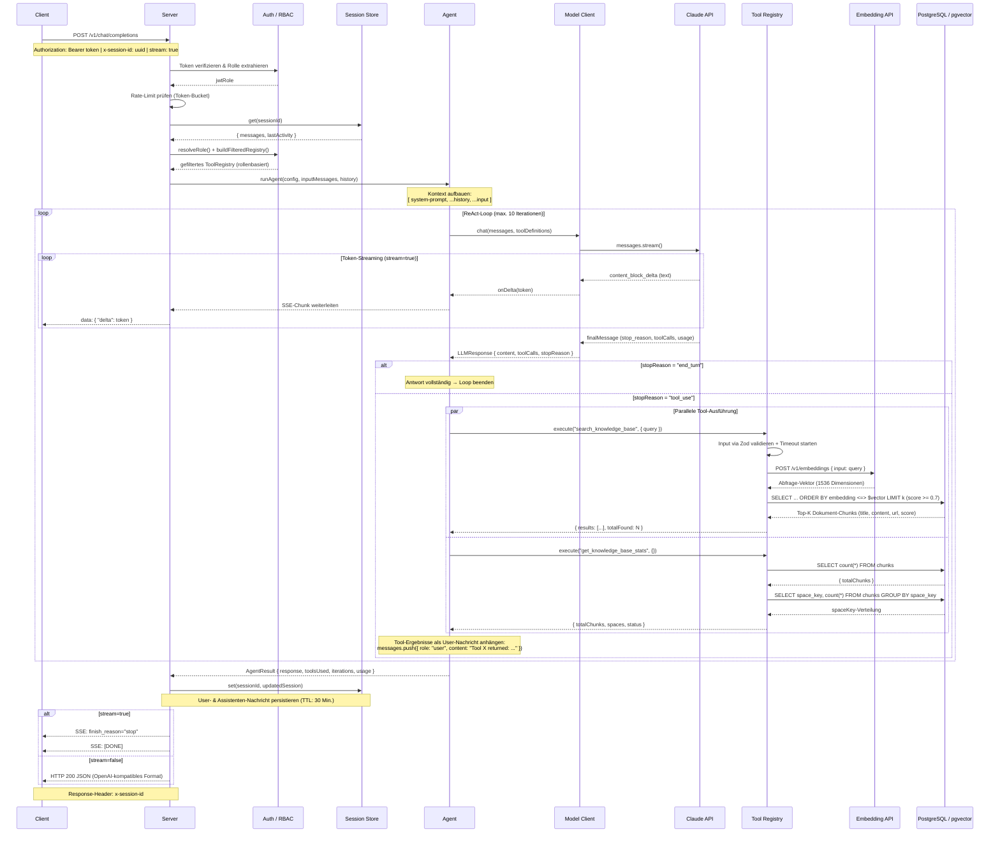

# Agent-Sequenzdiagramm: Verarbeitung einer Chat-Anfrage

```mermaid
sequenceDiagram
    participant C as Client
    participant S as Server
    participant Auth as Auth / RBAC
    participant Sess as Session Store
    participant Ag as Agent
    participant MC as Model Client
    participant LLM as Claude API
    participant TR as Tool Registry
    participant Emb as Embedding API
    participant Q as PostgreSQL / pgvector

    C->>S: POST /v1/chat/completions
    Note over C,S: Authorization: Bearer token | x-session-id: uuid | stream: true

    S->>Auth: Token verifizieren & Rolle extrahieren
    Auth-->>S: jwtRole

    S->>S: Rate-Limit prüfen (Token-Bucket)

    S->>Sess: get(sessionId)
    Sess-->>S: { messages, lastActivity }

    S->>Auth: resolveRole() + buildFilteredRegistry()
    Auth-->>S: gefiltertes ToolRegistry (rollenbasiert)

    S->>Ag: runAgent(config, inputMessages, history)

    Note over Ag: Kontext aufbauen:<br/>[ system-prompt, ...history, ...input ]

    loop ReAct-Loop (max. 10 Iterationen)

        Ag->>MC: chat(messages, toolDefinitions)
        MC->>LLM: messages.stream()

        loop Token-Streaming (stream=true)
            LLM-->>MC: content_block_delta (text)
            MC-->>Ag: onDelta(token)
            Ag-->>S: SSE-Chunk weiterleiten
            S-->>C: data: { "delta": token }
        end

        LLM-->>MC: finalMessage (stop_reason, toolCalls, usage)
        MC-->>Ag: LLMResponse { content, toolCalls, stopReason }

        alt stopReason = "end_turn"
            Note over Ag: Antwort vollständig → Loop beenden
        else stopReason = "tool_use"

            par Parallele Tool-Ausführung

                Ag->>TR: execute("search_knowledge_base", { query })
                TR->>TR: Input via Zod validieren + Timeout starten
                TR->>Emb: POST /v1/embeddings { input: query }
                Emb-->>TR: Abfrage-Vektor (1536 Dimensionen)
                TR->>Q: SELECT ... ORDER BY embedding <=> $vector LIMIT k (score >= 0.7)
                Q-->>TR: Top-K Dokument-Chunks (title, content, url, score)
                TR-->>Ag: { results: [...], totalFound: N }

            and

                Ag->>TR: execute("get_knowledge_base_stats", {})
                TR->>Q: SELECT count(*) FROM chunks
                Q-->>TR: { totalChunks }
                TR->>Q: SELECT space_key, count(*) FROM chunks GROUP BY space_key
                Q-->>TR: spaceKey-Verteilung
                TR-->>Ag: { totalChunks, spaces, status }

            end

            Note over Ag: Tool-Ergebnisse als User-Nachricht anhängen:<br/>messages.push({ role: "user", content: "Tool X returned: ..." })

        end

    end

    Ag-->>S: AgentResult { response, toolsUsed, iterations, usage }

    S->>Sess: set(sessionId, updatedSession)
    Note over S,Sess: User- & Assistenten-Nachricht persistieren (TTL: 30 Min.)

    alt stream=true
        S-->>C: SSE: finish_reason="stop"
        S-->>C: SSE: [DONE]
    else stream=false
        S-->>C: HTTP 200 JSON (OpenAI-kompatibles Format)
    end

    Note over C,S: Response-Header: x-session-id
```